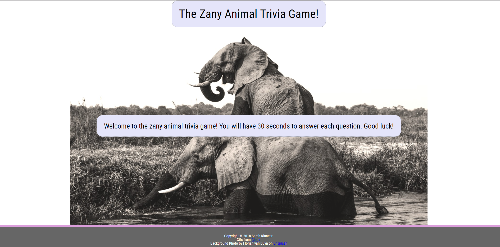

# Zany Animal Trivia Game
Interactive web browser game with HTML dynamically updated using jQuery timers.

## Developed by: Sarah Kinneer
## December, 2018

## Technologies Used:
JavaScript, jQuery (timers), HTML5, and CSS3

## Link to Live Site:
- [Play the Game!](https://kinneers.github.io/trivia-game/) - Head to the live site for some fun!

## To Use the Live Site:
- You will be alerted by a welcome screen to prepare to play
- You will be given 30 seconds to answer each of 10 multiple-choice questions involving bizarre animal facts.
- After 20 seconds, you will be presented with a screen displaying the correct answer and a related GIF.
- When the game is over, your score will be displayed and you will be given the option to play again.

## Photograph and Sound Sources:
Many thanks to Florian van Duyn from Unsplash for the background image!
Thank you to Giphy for the embedded GIFs!
